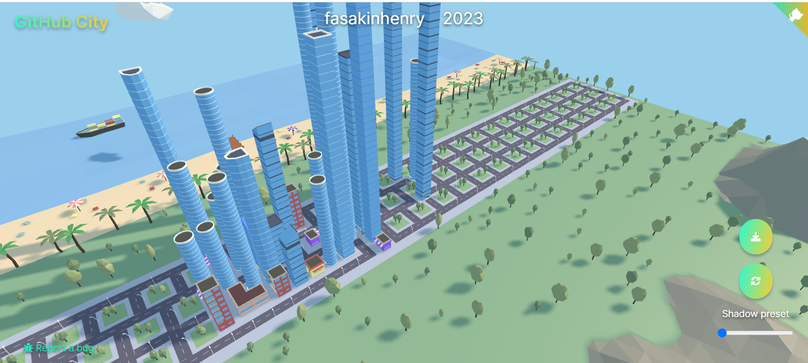

Hi My name is Fasakin Henry( @henqsoft)
=================================================================================================================================================

 

    <h1 align="center">✩&emsp;fasakinhenry&emsp;✩</h1>

    

 

    

    
    

Full stack web developer and Product designer
---------------------------------------------

* 🌍  I'm based in Nigeria
* ✉️  You can contact me at [fasakinhenry@gmail.com](mailto:fasakinhenry@gmail.com)
* 🚀  I'm currently working on [Chatty](http://github.com/Henqsoft-solutions/Chatty.git)
* 🧠  I'm learning C, JavaScript, Python, MERN, NEXTJS, JavaScript frameworks, AWS cloud
* 🤝  I'm open to collaborating on Open source projects
* ⚡  I have an experience of more than 4 years working in the tech field/space

## Skills

  
:zap: <h2>Technical skills</h2>

### 💼 Technical Skills

 

### 📃 Writing and Blog

 

### 🎨 Styling and cascading

 

### 🛠️ General and frequently used services

 

### 🌍 Browsers

 

### ☁️ Cloud hosting / SaaS

 

### 💾 Databases

 

### 🖌️ Design

 

### 🧑‍💻 Developer Forums

 

### 📕 Wiki / Documentation platforms

 

### 🎓 Education

 

### 💰 Funding

 

### 📚 Frameworks, platforms and Libraries

 

### ☁️ Hosting/SaaS

 

### 💻 IDEs/Editors

 

### 📋 Languages

 

### 🎶 Music

 

### 🏢 Office

<be>

### 🎛️ Operating System

 

### 🥅 Other

 

### 🔍 Search Engines

 

### 🗄️ Servers

 

### 💬 Social

 

### 📱 My Smartphone Brands

 

### 📺 Streaming

 

### 🕓 Version Control

 

### 💼 Work/Jobs

  
<h2>Technical overview</h2>

### Technical overview

## Socials

 

 <a href="https://www.dribbble.com/henqsoft" target="_blank" rel="noreferrer"> <picture> <source media="(prefers-color-scheme: dark)" srcset="undefined" /> <source media="(prefers-color-scheme: light)" srcset="https://raw.githubusercontent.com/danielcranney/readme-generator/main/public/icons/socials/dribbble.svg" />  </picture> </a> <a href="https://www.github.com/fasakinhenry" target="_blank" rel="noreferrer"> <picture> <source media="(prefers-color-scheme: dark)" srcset="https://raw.githubusercontent.com/danielcranney/readme-generator/main/public/icons/socials/github-dark.svg" /> <source media="(prefers-color-scheme: light)" srcset="https://raw.githubusercontent.com/danielcranney/readme-generator/main/public/icons/socials/github.svg" />  </picture> </a> <a href="http://www.instagram.com/henqsoft" target="_blank" rel="noreferrer"> <picture> <source media="(prefers-color-scheme: dark)" srcset="undefined" /> <source media="(prefers-color-scheme: light)" srcset="https://raw.githubusercontent.com/danielcranney/readme-generator/main/public/icons/socials/instagram.svg" />  </picture> </a> <a href="https://www.x.com/henqsoft" target="_blank" rel="noreferrer"> <picture> <source media="(prefers-color-scheme: dark)" srcset="https://raw.githubusercontent.com/danielcranney/readme-generator/main/public/icons/socials/twitter-dark.svg" /> <source media="(prefers-color-scheme: light)" srcset="https://raw.githubusercontent.com/danielcranney/readme-generator/main/public/icons/socials/twitter.svg" />  </picture> </a> <a href="https://www.youtube.com/@fashencode" target="_blank" rel="noreferrer"> <picture> <source media="(prefers-color-scheme: dark)" srcset="undefined" /> <source media="(prefers-color-scheme: light)" srcset="https://raw.githubusercontent.com/danielcranney/readme-generator/main/public/icons/socials/youtube.svg" />  </picture> </a>

## My GitHub Stats

 

## Top Repositories

       

 

------

## Check out my GitHub city to visualize my GitHub stats and graph

[Check out my city here](https://honzaap.github.io/GithubCity/?name=fasakinhenry&year=2023)

